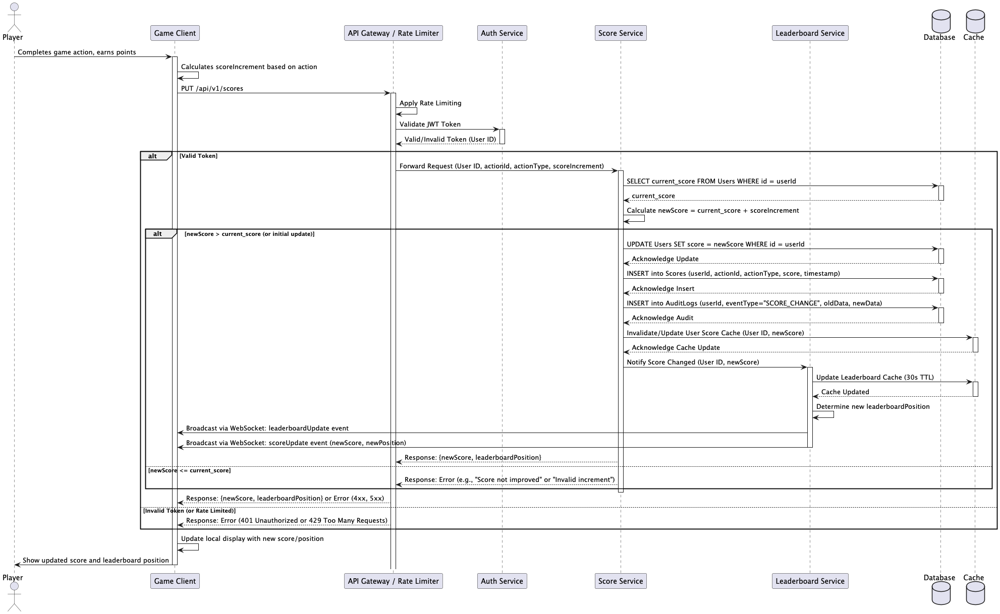

# Live Scoreboard API Service Specification

## Table of Contents
1. [Overview](#overview)
2. [System Architecture](#system-architecture)
3. [API Endpoints](#api-endpoints)
4. [Data Models](#data-models)
5. [Data Consistency](#data-consistency)
6. [Security Implementation](#security-implementation)
7. [Logging & Monitoring](#logging-and-monitoring)
8. [Error Handling](#error-handling)
9. [Performance Requirements](#performance-requirements)
10. [Additional Improvements](#additional-improvements)
11. [Sequence Diagram](#sequence-diagram)

## Overview

The Live Scoreboard API Service is an application that manages user scores and provides real-time updates for a competitive gaming or activity platform. The system ensures secure score updates while maintaining a live leaderboard of the top 10 users.

### Key Features
- **Top 10 Leaderboard**: Maintains and shows the current top 10 users
- **Real-time Score Updates**: Updates live score when user completes actions in real-time.
- **Authentication & Authorization**: Prevents unauthorized score manipulation
- **Scalable & Reliable System**: Designed to handle consistent and high concurrent user loads

## System Architecture

### High-Level Architecture
```
┌─────────────────┐    ┌──────────────────┐    ┌─────────────────┐
│   Frontend      │    │   API Gateway    │    │   Load Balancer │
│   (Website)     │◄──►│   / Rate Limiter │◄──►│                 │
└─────────────────┘    └──────────────────┘    └─────────────────┘
                                │ 
                                | WebSocket
                                ▼
┌────────────────────────────────────────────────────────────────┐
│                    Live Scoreboard API Service                 │
├─────────────────┬─────────────────┬────────────────────────────┤
│  Auth Service   │  Score Service  │  Leaderboard Service       │
│                 │                 │                            │
└─────────────────┴─────────────────┴────────────────────────────┘
                                │
                                ▼
┌────────────────────────────────────────────────────────────────┐
│                         Database Layer                         │
├─────────────────┬─────────────────┬────────────────────────────┤
│   Users Table   │  Scores Table   │          Audit Logs        │
│                 │                 │                            │
└─────────────────┴─────────────────┴────────────────────────────┘
```

### Tech Stack
- **Framework**: Node.js with Express.js
- **Database**: PostgreSQL (primary) + Redis (caching & distributed lock)
- **Real-time**: Socket.io for WebSocket connections
- **Auth**: JWT
- **Infra**: Azure

## API Endpoints

### Authentication Endpoints

#### POST /api/v1/auth/login
Authenticate user and return JWT token.

**Request Body:**
```json
{
  "email": "string",
  "password": "string"
}
```

**Response:**
```json
{
  "success": true,
  "token": "jwt_token_here",
  "user": {
    "id": "user_id",
    "username": "username",
  }
}
```

#### POST /api/v1/auth/register
Register new user account.

**Request Body:**
```json
{
  "email": "string",
  "password": "string"
}
```

### Score Management Endpoints

#### PUT /api/v1/scores
Update user score after completing an action.

**Headers:**
```
Authorization: Bearer <jwt_token>
Content-Type: application/json
```

**Request Body:**
```json
{
  "actionId": "string",
  "actionType": "string",
  "scoreIncrement": "number",
}
```

**Response:**
```json
{
  "newScore": 1600,
  "leaderboardPosition": 5
}
```

#### GET /api/v1/leaderboards
Get current top 10 leaderboard.

**Response:**
```json
{
  "success": true,
  "leaderboard": [
    {
      "position": 1,
      "userId": "user_id",
      "username": "username",
      "score": 2500,
    }
  ]
}
```

#### GET /api/v1/scores/user/:userId
Get specific user's score and position.

**Response:**
```json
{
  "success": true,
  "user": {
    "id": "user_id",
    "username": "username",
    "score": 1600,
    "position": 5,
  }
}
```

### WebSocket Events
Websocket communication for real-time updates

#### Connection
```javascript
// Client connects with JWT token
socket.emit('authenticate', { token: 'jwt_token' });
```

#### Real-time Updates
```javascript
// Server broadcasts leaderboard updates
socket.on('leaderboardUpdate', (data) => {
  // data contains updated leaderboard
});

// Server broadcasts user score updates
socket.on('scoreUpdate', (data) => {
  // data contains user's new score and position
});
```

## Data Models

### User Model
```javascript
{
  id: UUID,
  username: String (unique),
  email: String (unique),
  passwordHash: String,
  score: Number (default: 0),
  createdAt: Timestamp,
  updatedAt: Timestamp,
}
```

### Score Model
```javascript
{
  id: UUID,
  userId: UUID (foreign key),
  actionId: String,
  actionType: String,
  score: Number,
  timestamp: Timestamp,
  createdAt: Timestamp,
  updatedAt: Timestamp,
}
```

### Audit Log Model
```javascript
{
  id: UUID,
  userId: UUID (foreign key),
  objectID: UUID,
  eventType: String,
  status: String,
  oldData: String,
  newData: String
  createdAt: Timestamp,
  updatedAt: Timestamp,
}
```

## Data Consistency:
- **Race Condition**: use Redis as Distributed Locking mechanism at application layer and Optimistic Locking mechanism at database layer.


## Security Implementation

### 1. Authentication
- **JWT Tokens**: Secure token-based authentication
- **Token Expiration**: Configurable expiration time (default: 24 hours)
- **Refresh Tokens**: Automatic token refresh mechanism

### 2. Authorization
- **RBAC**: apply role-based access control model.

## Logging and Monitoring:

### 1. Audit Log
- **Score Changes**: Log all score modifications
- **Authentication Events**: Track login/logout attempts
- **Suspicious Activity**: Flag and log potential cheating
- **IP Tracking**: Monitor IP address changes

### 3. Obserability System: 
- **Logs**: Stream app logs via container log agent
- **Metrics**: OpenTelemetry, Prometheus, Grafana
- **Traces**: OpenTelemetry, Jeager


## Error Handling

### HTTP Status Codes
- **200**: Success
- **201**: Created
- **400**: Bad Request (validation errors)
- **401**: Unauthorized (invalid/missing token)
- **403**: Forbidden (insufficient permissions)
- **404**: Not Found
- **429**: Too Many Requests (rate limit exceeded)
- **500**: Internal Server Error

### Error Response Format
```json
{
  "success": false,
  "error": {
    "code": "VALIDATION_ERROR",
    "message": "Invalid score increment value",
    "details": {
      "field": "scoreIncrement",
      "value": -50,
      "constraint": "Must be positive"
    }
  },
  "timestamp": "2024-01-15T10:30:00Z"
}
```

## Performance Requirements

### Response Times
- **API Endpoints**: < 200ms average response time
- **Leaderboard Updates**: < 100ms broadcast time
- **Database Queries**: < 50ms average query time
- **WebSocket Latency**: < 50ms message delivery

### Caching Strategy
- **Leaderboard Cache**: 30-second TTL
- **User Score & Position Cache**: 5-minute TTL
- **Rate Limit Cache**: 15-minute TTL

## Additional Improvements
1. **Backup Strategy**: Regular database backups and recovery procedures
2. **Disaster Recovery**: Multi-region deployment and failover mechanisms
3. **API Versioning**

## Sequence Diagram


